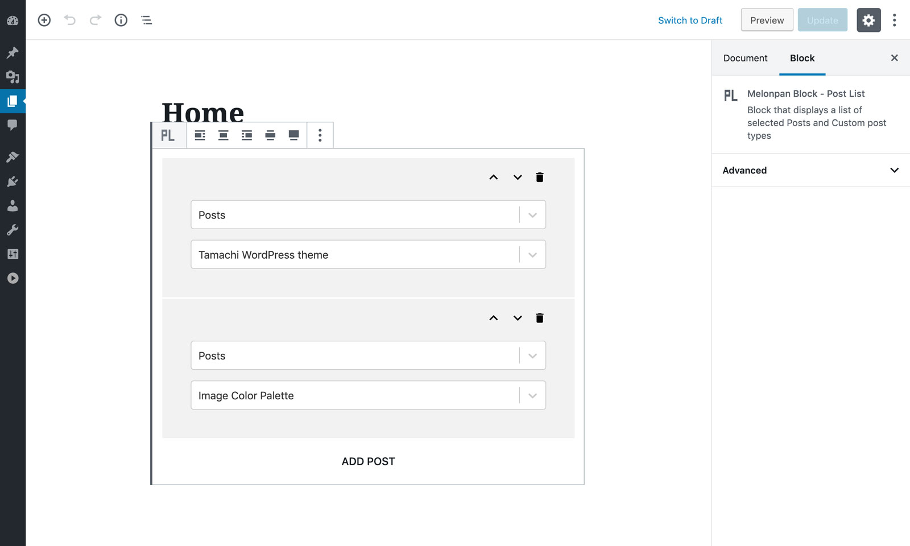

# Melonpan Block - Post List

[Documentation](https://melonpan.io/gutenberg-blocks/melonpan-block-post-list) - [WordPress](https://wordpress.org/plugins/melonpan-block-post-list)

 

Block that displays a list of selected Posts and Custom post types. No stylesheets or scripts are added in the front-end.

 

## Plugin and Theme developers

To modify the front-end HTML the filter `mbpl_content_to_render` can be used. For more info check the [documentation](https://melonpan.io/gutenberg-blocks/melonpan-block-post-list).

 

## Screenshots

